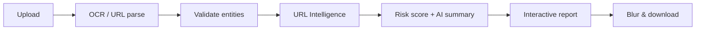

<p align="center">
  
</p>

<h1 align="center">🛡 RiskDetect AI</h1>

<p align="center">
  <strong>AI-Powered Privacy & Digital Risk Intelligence</strong><br />
  <em>Scan. Detect. Protect.</em>
</p>

<p align="center">
  Find sensitive data in screenshots and risky URLs — <strong>before</strong> you share them.
</p>

<p align="center">
  
  
  
  
</p>

---

## What is RiskDetect AI?

Your last screenshot might be carrying secrets you never meant to share.

RiskDetect AI is a privacy guard for the stuff you send every day — **screenshots** and **URLs**. It hunts down sensitive details, tells you _why_ they matter in plain English, and helps you clean them up before they leave your device: blur the hotspots, follow the fixes, and export a report you can keep.

> Upload a payment receipt → see UPI, phone, and transaction IDs highlighted → blur them → share safely.

---

## The Problem

People share screenshots every day without noticing what’s inside:

- Payment receipts expose **UPI IDs** and transaction details
- Bank screenshots leak **account numbers** and **IFSC** codes
- ID photos reveal **Aadhaar**, **PAN**, or passport numbers
- Debug screenshots leak **API keys** and tokens
- Suspicious links lead to **phishing**

One careless share can mean fraud, identity theft, or a credential breach.

---

## How It Works

```text
Upload screenshot / paste URL
        ↓
   OCR + AI analysis
        ↓
 Detect & validate sensitive data
        ↓
 URL Intelligence (typosquat / brand / homoglyph)
        ↓
   Risk score + plain-language report
        ↓
 Blur preview → download safe version
```



---

## Features

| Feature                  | What it does                                               | Status |
| ------------------------ | ---------------------------------------------------------- | :----: |
| Screenshot scanner       | OCR + privacy analysis on images                           |   ✅   |
| URL risk scanner         | Phishing / malware signals + AI explanation                |   ✅   |
| URL Intelligence engine  | Typosquatting, homoglyphs, brand impersonation             |   ✅   |
| Screenshot phishing URLs | Same engine on every OCR-extracted link                    |   ✅   |
| Sensitive data detection | Email, phone, UPI, PAN, Aadhaar, cards, API keys, and more |   ✅   |
| Checksum validation      | Luhn (cards), Verhoeff (Aadhaar) to cut false positives    |   ✅   |
| Interactive viewer       | Bounding boxes, heatmap, zoom, blur, side-by-side          |   ✅   |
| AI report                | Risk score, summary, recommendations, checklist            |   ✅   |
| Security Copilot         | In-app chat about your findings                            |   ✅   |
| Dashboard & history      | Track past scans and risk trends                           |   ✅   |
| Auth + dark mode         | Supabase login, light/dark theme                           |   ✅   |
| HTML report download     | Printable intelligence report                              |   ✅   |

---

## URL Intelligence & Phishing Detection

RiskDetect AI does **not** treat a link as safe just because it is well-formed. Both the **URL scanner** and the **screenshot scanner** run the same modular URL Intelligence engine.

**Pipeline:** normalize → parse domain / TLD / subdomains → decode punycode → brand similarity → typosquatting → homoglyphs → keywords / TLD / depth heuristics → risk score → AI explanation.

| Signal                   | Example                                              | Typical risk    |
| ------------------------ | ---------------------------------------------------- | --------------- |
| Typosquatting            | `rnicrosoft.com` vs `microsoft.com` (`rn` → `m`)     | High / Critical |
| Brand impersonation      | `login.rnicrosoft.com/security/verify`               | Critical        |
| Homoglyph / digit swaps  | `goog1e.com`, `amaz0n.com`, `paypaI.com`             | High / Critical |
| Suspicious path keywords | `/login`, `/verify`, `/secure` with a lookalike host | Elevated        |
| Shorteners               | `bit.ly`, `tinyurl.com` (destination unknown)        | Medium+         |
| Raw IP hosts             | `http://192.168.1.1/login`                           | High            |
| Official brand domains   | `microsoft.com`, `github.com`, `openai.com`          | Safe / Low      |

**Screenshot path:** OCR text is healed for common glitches (spaced hosts, broken `https://`, scheme-less domains), every extracted URL is analyzed, findings show threat type + confidence + recommendation, and bounding boxes stay synced when you click a URL finding. Overall image risk cannot be marked **SAFE** when a high/critical phishing URL is present.

**Threat feeds:** URLHaus and OpenPhish still contribute; a pluggable reputation layer is ready for Safe Browsing / VirusTotal-style providers later.

---

## What We Detect

**PII** · Email · Phone · Aadhaar · PAN · Passport

**Financial** · UPI · Cards (Luhn) · CVV · IFSC · Bank account · Transaction IDs

**Secrets** · API keys · AWS / GitHub tokens · JWTs · Private keys · Passwords

**Network** · URLs · IP · MAC · OpenPhish / URLHaus

**Phishing / URL intel** · Typosquatting · Homoglyphs · Brand impersonation · Suspicious keywords · Deep subdomains · Risky TLDs · Shorteners

Each hit gets a **confidence score**, **severity**, and a short **why it matters** explanation.

---

## Tech Stack

RiskDetect AI is built with a modern full-stack TypeScript stack:

| Area                | Technology                                         |
| ------------------- | -------------------------------------------------- |
| **Frontend**        | Next.js 15 (App Router) · React 19 · TypeScript    |
| **Styling / UI**    | Tailwind CSS · shadcn/ui · Radix UI · Lucide icons |
| **Animations**      | Framer Motion                                      |
| **Charts**          | Recharts                                           |
| **State / Data**    | TanStack Query · Zustand                           |
| **Forms**           | React Hook Form · Zod                              |
| **Theming**         | next-themes (light / dark mode)                    |
| **Backend**         | Next.js API Route Handlers                         |
| **Auth & Database** | Supabase (Auth, SSR, Postgres migrations)          |
| **OCR**             | Tesseract.js                                       |
| **AI**              | OpenAI (`gpt-4o-mini`)                             |
| **Threat Intel**    | URLHaus · OpenPhish                                |
| **QR**              | jsQR                                               |
| **Testing**         | Vitest                                             |
| **Tooling**         | ESLint · Prettier · Husky · pnpm                   |
| **Deployment**      | Vercel · Docker · docker-compose · Node 20         |

---

## Deploy on Vercel

1. Push this repo to GitHub and import it in [Vercel](https://vercel.com/new).
2. Framework preset: **Next.js** (auto-detected). Install command: `pnpm install`.
3. Add environment variables from `.env.example` (see table below). Set `NEXT_PUBLIC_APP_URL` to your Vercel URL.
4. In Supabase → Authentication → URL Configuration, add `https://YOUR_APP.vercel.app` and `/auth/callback` to redirect allow-list.
5. Deploy. Image OCR needs Node.js serverless (`maxDuration` 60s) — **Pro plan recommended** for reliable scans.

```bash
pnpm build && pnpm start   # production locally
docker compose up --build  # Docker (sets DOCKER_BUILD=1 for standalone output)
```

---

## Quick Start

**Needs:** Node 20+, pnpm, OpenAI API key, Supabase (local or cloud)

```bash
git clone https://github.com/akshitkanolkar/RiskDetect-AI-OpenAI-Codex-Hackathon.git
cd RiskDetect-AI-OpenAI-Codex-Hackathon
pnpm install
cp .env.example .env.local
```

Fill in `.env.local`:

| Variable                        | Required | Purpose                                 |
| ------------------------------- | :------: | --------------------------------------- |
| `NEXT_PUBLIC_SUPABASE_URL`      |    ✅    | Supabase project URL                    |
| `NEXT_PUBLIC_SUPABASE_ANON_KEY` |    ✅    | Supabase anon (public) key              |
| `SUPABASE_SERVICE_ROLE_KEY`     |    ✅    | Server-side Supabase key (never expose) |
| `OPENAI_API_KEY`                |    ✅    | OpenAI key for analysis + copilot       |
| `OPENAI_MODEL`                  |    ⬜    | Default: `gpt-4o-mini`                  |
| `NEXT_PUBLIC_APP_URL`           |   ✅*    | App URL (`*` required on Vercel)        |
| `NEXT_PUBLIC_APP_NAME`          |    ⬜    | Display name (default: RiskDetect AI)   |

> OCR uses **Tesseract.js** in-process (no OCR API key). Uploads are capped at **4MB** for Vercel body limits.

```bash
pnpm supabase:start   # local Supabase
pnpm env:sync         # optional: sync local keys
pnpm dev              # http://localhost:3000
```

Try sample images in `samples-hackathon/`.

```bash
pnpm build && pnpm start   # production locally
```

---

## Project Structure

```text
app/                      # Pages + API routes
components/scans/         # Scanner, report, interactive viewer
services/detection/       # Entity extractors & validators (OCR pipeline)
services/url-validation/  # URL Intelligence (typosquat, brands, screenshot URLs)
services/ai/              # OpenAI analysis
lib/report/               # Privacy score, scenarios, checklist
supabase/                 # Migrations
samples-hackathon/        # Demo screenshots
```

---

## Why RiskDetect AI?

| Other tools      | RiskDetect AI                                   |
| ---------------- | ----------------------------------------------- |
| Dump OCR text    | Validate entities + score real risk             |
| “Valid URL = OK” | Typosquat / brand / homoglyph phishing analysis |
| “PII found”      | Plain-language AI explanation                   |
| Static list      | Interactive boxes, heatmap, blur                |
| No next steps    | Recommendations + security checklist            |

Built for real India-aware cases (UPI, Aadhaar, PAN, IFSC) and a product UX people will actually use.

---

## Future Enhancements

- 🌐 **Browser Extension** — Scan screenshots and web pages in real time before sharing
- 📱 **Mobile App** — Analyze gallery images and screenshots with AI-powered redaction
- 📄 **Document Scanner** — Support PDFs, Word, Excel, and other documents for sensitive data detection
- 🛰️ **External reputation APIs** — Optional Google Safe Browsing, VirusTotal, PhishTank providers
- 🏢 **Enterprise Dashboard** — Team workspaces, bulk scanning, compliance reports, and role-based access control (RBAC)

---

## Demo

|               |                      |
| ------------- | -------------------- |
| **Live demo** | _Add URL_            |
| **Video**     | _Add link_           |
| **Samples**   | `samples-hackathon/` |

---

## Team

| Name            | Role                     |
| --------------- | ------------------------ |
| Akshit Kanolkar | Senior Software Engineer |

---

## Closing Note

RiskDetect AI started from a simple idea: people share screenshots and links every day without seeing what they expose. This project turns that moment into a clear risk report — detect, validate, explain, and help you share safely.

Built solo for the OpenAI Codex Hackathon, with **Cursor** and **OpenAI Codex** used throughout development and planning to move faster on architecture, implementation, and iteration.

Thank you for the opportunity — I would love to hear your feedback.
