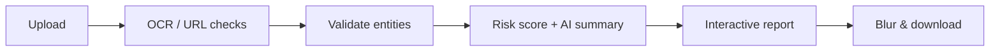

<p align="center">
  
</p>

<h1 align="center">🛡 SafeLens AI</h1>

<p align="center">
  <strong>AI-Powered Privacy & Digital Risk Intelligence</strong><br />
  <em>Scan. Detect. Protect.</em>
</p>

<p align="center">
  Find sensitive data in screenshots and risky URLs — <strong>before</strong> you share them.
</p>

<p align="center">
  
  
  
  
</p>

---

## What is SafeLens?

SafeLens analyzes **screenshots** and **URLs** to detect private information, explain the risk in plain language, and show how to fix it — with blur, recommendations, and a downloadable report.

> Upload a payment receipt → see UPI, phone, and transaction IDs highlighted → blur them → share safely.

---

## The Problem

People share screenshots every day without noticing what’s inside:

- Payment receipts expose **UPI IDs** and transaction details
- Bank screenshots leak **account numbers** and **IFSC** codes
- ID photos reveal **Aadhaar**, **PAN**, or passport numbers
- Debug screenshots leak **API keys** and tokens
- Suspicious links lead to **phishing**

One careless share can mean fraud, identity theft, or a credential breach.

---

## How It Works

```text
Upload screenshot / paste URL
        ↓
   OCR + AI analysis
        ↓
 Detect & validate sensitive data
        ↓
   Risk score + plain-language report
        ↓
 Blur preview → download safe version
```



---

## Features

| Feature                        | What it does                                               | Status |
| ------------------------------ | ---------------------------------------------------------- | :----: |
| Screenshot scanner             | OCR + privacy analysis on images                           |   ✅   |
| URL risk scanner               | Phishing / malware signals + AI explanation                |   ✅   |
| Sensitive data detection       | Email, phone, UPI, PAN, Aadhaar, cards, API keys, and more |   ✅   |
| Checksum validation            | Luhn (cards), Verhoeff (Aadhaar) to cut false positives    |   ✅   |
| Interactive viewer             | Bounding boxes, heatmap, zoom, blur, side-by-side          |   ✅   |
| AI report                      | Risk score, summary, recommendations, checklist            |   ✅   |
| Security Copilot               | In-app chat about your findings                            |   ✅   |
| Dashboard & history            | Track past scans and risk trends                           |   ✅   |
| Auth + dark mode               | Supabase login, light/dark theme                           |   ✅   |
| HTML report download           | Printable intelligence report                              |   ✅   |
| PDF export / browser extension | Coming next                                                |   🚧   |

---

## What We Detect

**PII** · Email · Phone · Aadhaar · PAN · Passport

**Financial** · UPI · Cards (Luhn) · CVV · IFSC · Bank account · Transaction IDs

**Secrets** · API keys · AWS / GitHub tokens · JWTs · Private keys · Passwords

**Network** · URLs · IP · MAC · Phishing signals (OpenPhish / URLHaus)

Each hit gets a **confidence score**, **severity**, and a short **why it matters** explanation.

---

## Tech Stack

SafeLens is built with a modern full-stack TypeScript stack:

| Area                | Technology                                         |
| ------------------- | -------------------------------------------------- |
| **Frontend**        | Next.js 15 (App Router) · React 19 · TypeScript    |
| **Styling / UI**    | Tailwind CSS · shadcn/ui · Radix UI · Lucide icons |
| **Animations**      | Framer Motion                                      |
| **Charts**          | Recharts                                           |
| **State / Data**    | TanStack Query · Zustand                           |
| **Forms**           | React Hook Form · Zod                              |
| **Theming**         | next-themes (light / dark mode)                    |
| **Backend**         | Next.js API Route Handlers                         |
| **Auth & Database** | Supabase (Auth, SSR, Postgres migrations)          |
| **OCR**             | Tesseract.js                                       |
| **AI**              | OpenAI (`gpt-4o-mini`)                             |
| **Threat Intel**    | URLHaus · OpenPhish                                |
| **QR**              | jsQR                                               |
| **Testing**         | Vitest                                             |
| **Tooling**         | ESLint · Prettier · Husky · pnpm                   |
| **Deployment**      | Docker · docker-compose · Node 20                  |

---

## Quick Start

**Needs:** Node 20+, pnpm, OpenAI API key, Supabase (local or cloud)

```bash
git clone https://github.com/akshitkanolkar/SafeLens-AI-OpenAI-Codex-Hackathon.git
cd SafeLens-AI-OpenAI-Codex-Hackathon
pnpm install
cp .env.example .env.local
```

Fill in `.env.local`:

| Variable                        | Required | Purpose                          |
| ------------------------------- | :------: | -------------------------------- |
| `NEXT_PUBLIC_SUPABASE_URL`      |    ✅    | Supabase URL                     |
| `NEXT_PUBLIC_SUPABASE_ANON_KEY` |    ✅    | Supabase anon key                |
| `SUPABASE_SERVICE_ROLE_KEY`     |    ✅    | Server-side Supabase key         |
| `OPENAI_API_KEY`                |    ✅    | OpenAI key                       |
| `OPENAI_MODEL`                  |    ⬜    | Default: `gpt-4o-mini`           |
| `NEXT_PUBLIC_APP_URL`           |    ⬜    | Default: `http://localhost:3000` |

```bash
pnpm supabase:start   # local Supabase
pnpm env:sync         # optional: sync local keys
pnpm dev              # http://localhost:3000
```

Try sample images in `samples-hackathon/`.

```bash
pnpm build && pnpm start   # production
docker compose up --build  # Docker
```

---

## Project Structure

```text
app/                 # Pages + API routes
components/scans/    # Scanner, report, interactive viewer
services/detection/  # Entity extractors & validators
services/ai/         # OpenAI analysis
lib/report/          # Privacy score, scenarios, checklist
supabase/            # Migrations
samples-hackathon/   # Demo screenshots
```

---

## Why SafeLens?

| Other tools   | SafeLens                             |
| ------------- | ------------------------------------ |
| Dump OCR text | Validate entities + score real risk  |
| “PII found”   | Plain-language AI explanation        |
| Static list   | Interactive boxes, heatmap, blur     |
| No next steps | Recommendations + security checklist |

Built for real India-aware cases (UPI, Aadhaar, PAN, IFSC) and a product UX people will actually use.

---

## Future Enhancements

- [ ] 🌐 **Browser Extension** — Scan screenshots and web pages in real time before sharing
- [ ] 📱 **Mobile App** — Analyze gallery images and screenshots with AI-powered redaction
- [ ] 📄 **Document Scanner** — Support PDFs, Word, Excel, and other documents for sensitive data detection
- [ ] 🛡️ **Advanced Phishing Detection** — Enhance URL scanning with malware, phishing, and domain reputation analysis
- [ ] 🏢 **Enterprise Dashboard** — Team workspaces, bulk scanning, compliance reports, and role-based access control (RBAC)

---

## Demo

|               |                      |
| ------------- | -------------------- |
| **Live demo** | _Add URL_            |
| **Video**     | _Add link_           |
| **Samples**   | `samples-hackathon/` |

---

## Team

| Name        | Role                 |
| ----------- | -------------------- |
| _Your name_ | Full-stack / product |
| _Teammate_  | Frontend / design    |
| _Teammate_  | AI / security        |

---

## For Judges

Thanks for reviewing **SafeLens AI**.

We built this for a real privacy problem: people share screenshots and links without knowing what leaks. SafeLens goes beyond OCR — it **validates**, **scores**, **explains**, and helps you **fix** exposure before you hit send.

We hope the detection quality, interactive report, and polish come through in the demo.

---

## Credits

Built with OpenAI, Next.js, Supabase, Tesseract.js, Tailwind, shadcn/ui, and Framer Motion.
